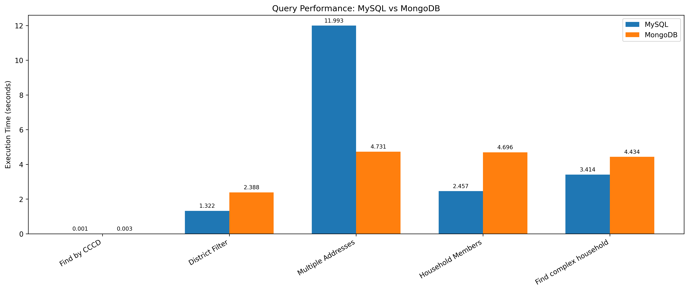
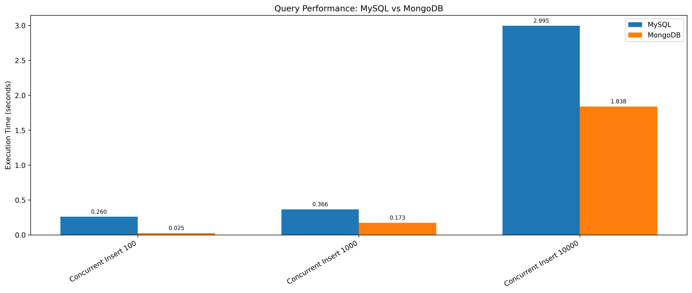
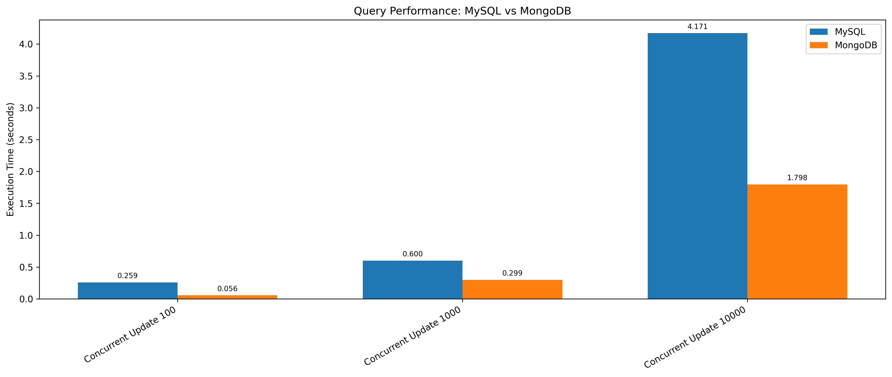

# Compare MySQL and Mongodb

Setup  
Supposing that docker-compose was installed

Step 0: Prepare data  
Put sql files into sql-init folder  
Put json files into mongo-init folder  

Step 1: Run docker-compose to start mysql and mongodb  
`docker-compose up -d`

Step 2: Run script main.py to compare mysql and mongodb  
Compare query  
`python run_query.py`  

Compare insert and update  
`python run_insert_update.py`

Expected result  
Query
  
Insert  
  

Update  
  